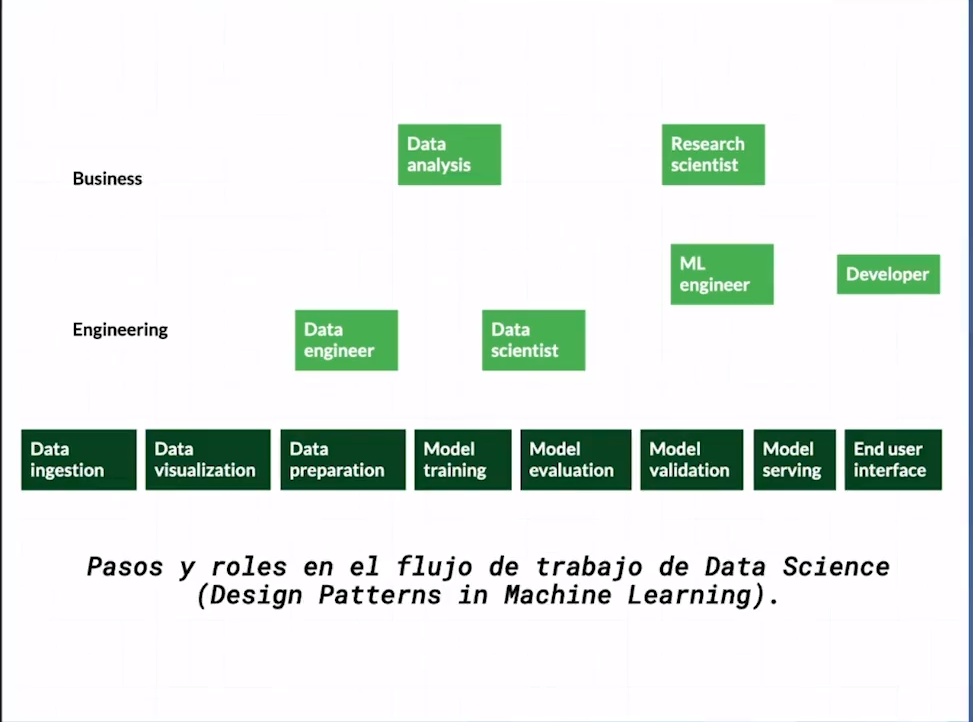

# Curso de Matemáticas para Data Science: Estadística Descriptiva

## ¿Para qué sirve la estadística descriptiva?

La estadística descriptiva sirve para 2 cosas:

Anális exploratorio de la información.
Preprocesamiento de la información antes de tener un modelo de machine learning.

### Estadística descriptiva vs. inferencial

#### Estadística descriptiva

Foco principal de este curso

Se enfoca en resumir un historial de datos.

Una de las desventajas que tiene es que **se puede mentir con estadistica**, esto se hace al destacar solo la informacion o metricas que nos convienen.

Las mediciones o metricas de los datos que nos dan informacion de ellos se conocen como **estadisticos descriptivos**. un ejemplo de esto es la cantidad de goles de un jugador en un campeonato.

    "Con frecuencia construimos un caso estadístico con datos imperfectos, como resultado hay numerosas raazones por las cuales individuos intelectuales respetables pueden no estar de acuerdo sobre los resultados estadísticos."

  **-Naked Statistics (Charles Wheelan).**

**Ejemplo:**

Resumir historial deportivo de un jugador.

#### Estadística inferencial: predecir con datos

¿Por qué aprender estadística?
Resumir grandes cantidades de información para tomar mejores decisiones.
Responder preguntas con relevancia social.
Reconocer patrones en los datos.

**Ejemplo:**

Predecir desempeño de un jugador de futbol en el futuro.

### Por qué aprender estadística?

- resumir grandes cantidades de informacion
- Tomar mejores decisiones (o peores)
- Responder preguntas con relevancia social
- Reconocer patrones en los datos
- Descubrir a quienes usan estas herramientas con fines nefastos.

## Flujo de trabajo en data science

En el flujo de un proyecto de machine learning, diversos roles se enfocan en distintas partes del proceso.

- Data Engineer: Se encofoca en la Preparacioncion de los datos
- Data analysis: Se enfoca en el Entrenamiento del modelo
- Data Scientist: Se enfoca en el Entrenamiento y la Evaluacion del modelo
- Research Scientist y ML Engineer: Se enfoca en la Validacion del modelo y Model Serving (Como se le sera servido este modelo al sistema principal)
- Developer: Se enfoca en la Interfaz del usuario final, conectando asi el modelo listo con el sistema principal que usara el usuario final.

En los bloques del procesamiento la estadistica descriptiva juega un rol importante en los primeros dos bloques

1. Ingesta de datos y Validacion de los datos
2. **Preparacion de los datos y Entrenamiento del modelo** (aqui se usa mas)

# platzi-curso-estadistica-descriptiva-2021

Este repositorio contiene los notebooks del curso en Platzi [Curso de matemáticas para data science: estadística descriptiva](https://platzi.com/cursos/estadistica-descriptiva/)

Puedes utilizar Deepnote para trabajar interactivamente con los notebooks siguiendo el enlace de este botón:

## Referencias adicionales del curso: 

* [Outlier detection for skewed data](https://wis.kuleuven.be/stat/robust/papers/2008/outlierdetectionskeweddata-revision.pdf)
* [Probability and Statistics for Data Science](https://cims.nyu.edu/~cfgranda/pages/stuff/probability_stats_for_DS.pdf)

## Repasar

https://platzi.com/clases/2353-estadistica-descriptiva/38406-procesamiento-de-datos-numericos-en-python/

https://platzi.com/clases/2353-estadistica-descriptiva/38405-transformacion-no-lineal/

https://platzi.com/clases/2353-estadistica-descriptiva/38399-medidas-de-dispersion/

https://platzi.com/clases/2353-estadistica-descriptiva/38393-flujo-de-trabajo-en-data-science/

https://platzi.com/clases/2353-estadistica-descriptiva/38392-estadistica-descriptiva-vs-inferencial/